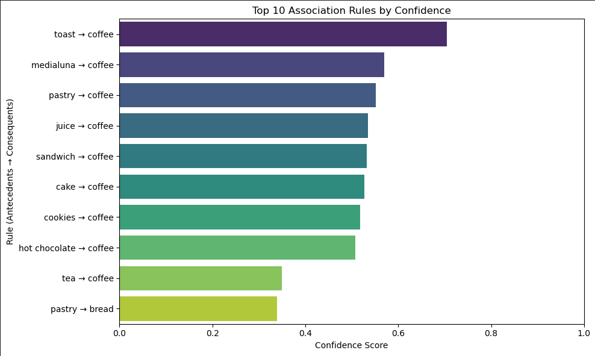
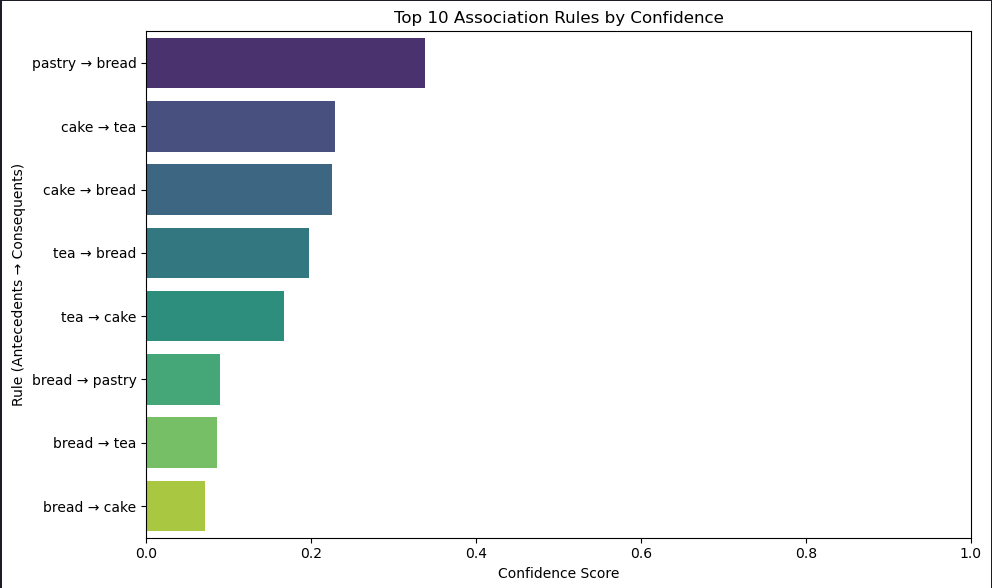
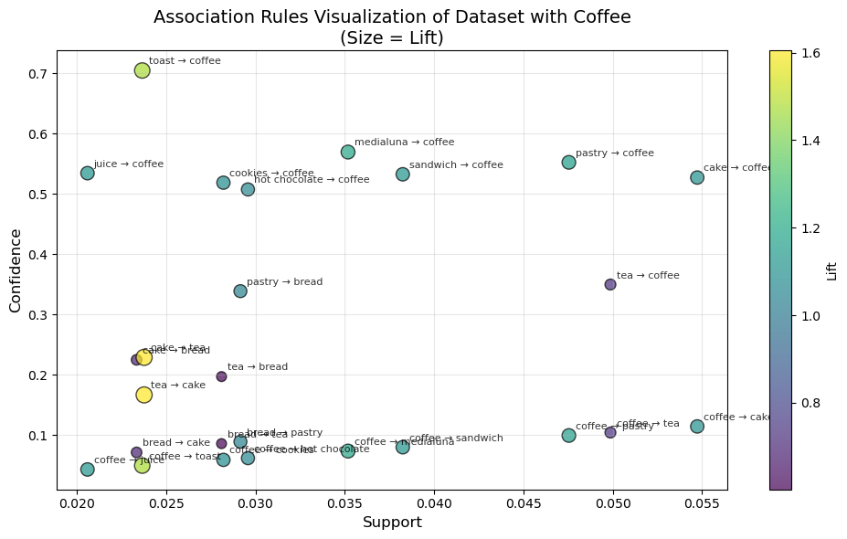
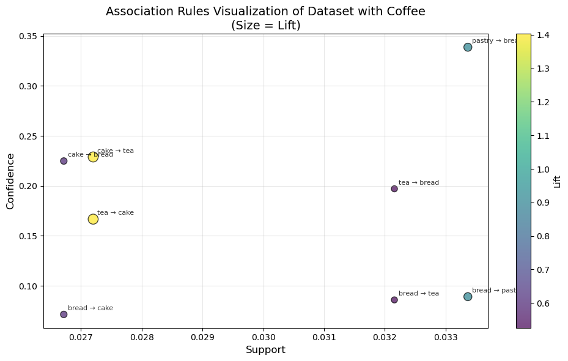

# Bakery Market Basket Analysis
**CSC172 Data Mining and Analysis Final Project**  
*Mindanao State University - Iligan Institute of Technology*  
**Student:** Mark Angelo L. Gallardo, 2022-0182   
**Semester:** AY 2025-2026 Sem 1  

## Abstract
This project implements the Apriori algorithm for association rule mining on the Bread Basket Dataset which contains a total of 9,465 transactions. Key findings include a top rule of "IF bread THEN coffee", temporal analysis, and a top rule of "IF pastry THEN bread" for the basket without coffee. The analysis pipeline includes exploratory data analysis (EDA), rule generation, and evaluation using support, confidence, and lift metrics. Business insights and actionable recommendations are derived from the strongest rules for both with or without coffee as well as the general observed temporal patterns.

## Table of Contents
- [Abstract](#abstract)
- [1. Introduction](#1-introduction)
  - [1.1 Problem Statement](#11-problem-statement)
  - [1.2 Objectives](#12-objectives)
  - [1.3 Scope and Limitations](#13-scope-and-limitations)
- [2. Dataset Description](#2-dataset-description)
  - [2.1 Source and Acquisition](#21-source-and-acquisition)
  - [2.2 Data Structure](#22-data-structure)
  - [2.3 Sample Transactions](#23-sample-transactions)
- [3. Methodology](#3-methodology)
  - [3.1 Data Preprocessing](#31-data-preprocessing)
  - [3.2 Exploratory Data Analysis](#32-exploratory-data-analysis)
  - [3.3 Apriori Algorithm Implementation](#33-apriori-algorithm-implementation)
  - [3.4 Evaluation Metrics](#34-evaluation-metrics)
- [4. Results](#4-results)
  - [4.1 Top Association Rules](#41-top-association-rules)
  - [4.2 Key Visualizations](#42-key-visualizations)
  - [4.3 Performance Metrics](#43-performance-metrics)
- [5. Discussion](#5-discussion)
  - [5.1 Business Insights](#51-business-insights)
  - [5.2 Actionable Recommendations](#52-actionable-recommendations)
  - [5.3 Limitations](#53-limitations)
- [6. Conclusion](#6-conclusion)
- [7. Video Presentation](#7-video-presentation)
- [References](#references)
- [Appendix: Full Results](#appendix-full-results)

## 1. Introduction
### 1.1 Problem Statement
Bakeries and Cafés face already experience high bread spoilage rates due to their short shelf life. To help with this and also increase profit, owners need to know not just what sells but also what sells with their offered product. This project analyzes transactional data to identify strong co-purchase patterns and check which have strong associations. Locally relevant for Philippine bakeries and cafes for analyzing customer buying behavior.

### 1.2 Objectives
- Preprocess the bakery/cafe data and perform EDA with visualizations
- Implement Apriori algorithm twice to generate association rules, one with coffee and one without, both implemented with parameter tuning
- Generate and evaluate top association rules
- Evaluate rules using support, confidence, and lift
- Visualize patterns and derive business insights

### 1.3 Scope and Limitations
**Scope:** Temporal Analysis of purchasing behavior, Single snapshot analysis of bakery purchase patterns using Apriori algorithm  
**Limitations:** January 2016 - December 2017 transactions with some months having no data at all

## 2. Dataset Description
### 2.1 Source and Acquisition
**Source:** [Bread Basket Dataset - Kaggle](https://www.kaggle.com/datasets/heeraldedhia/groceries-dataset)  
**Size:** 9,465 transactions, 94 unique items  
**Format:** Transaction + Item + date_time + period_day + weekday_weekend → Transaction basket format

### 2.2 Data Structure
Raw format (one row per item):  
Transaction,Item,date_time,period_day,weekday_weekend  
1,Bread,30-10-2016 09:58,morning,weekend  
2,Scandinavian,30-10-2016 10:05,morning,weekend  
2,Scandinavian,30-10-2016 10:05,morning,weekend

Transaction format (one row per basket):  
[['Bread'], ['Scandinavian', 'Scandinavian'], ['Hot chocolate', 'Jam', 'Cookies']]

### 2.3 Sample Transactions
Transaction 1: ['Bread']  
Transaction 2: ['Scandinavian', 'Scandinavian']
Transaction 3: ['Hot chocolate', 'Jam', 'Cookies']

## 3. Methodology

### 3.1 Data Preprocessing
1. **One-Hot Encoding:** Converted to 9,465 × 94 binary transaction matrix
2. **Item Filtering:** Retained top 32 items (support > 0.02) → 9,708 × 32 matrix
3. **Final Dataset:** 9,465 transactions × 32 items

**Before/After Statistics:**
| Metric | Raw Data | Processed Data |
|--------|----------|----------------|
| Unique Items | 94 | 32 |

### 3.2 Exploratory Data Analysis
- **Top 10 Items:** coffee (26.7%), bread (16.2%), tea (7%), cake (5%), pastry (4.2%), sandwich (3.8%), medialuna (3%), hot chocolate (2.9%), cookies (2.6%), brownie (1.8%)
- **Basket Size:** Mean=2.2 items, 85.2% transactions contain 1-3 items
- **Co-occurrence:** The **top 17 items**:  
['coffee', 'bread', 'tea', 'cake', 'pastry', 'sandwich', 'medialuna', 'hot chocolate', 'cookies', 'brownie', 'farm house', 'muffin', 'alfajores', 'juice', 'soup', 'scone', 'toast']  
appears with **100% of top 20 items** while  the **top 18-20th** items ['scandinavian', 'truffles', 'coke'] appears with **95% of the items**
- **Most Purchases** - Most daily orders are done aroung **10am - 4pm**, Most of the weekly orders happen during **Saturday**, **November** had the most orders throughout the years.

### 3.3 Apriori Algorithm Implementation
**Implementation:** mlxtend.frequent_patterns.apriori() with association_rules()

### 3.4 Evaluation Metrics
- **Support:** \($\frac{\text{frequency}(A \cup B)}{N}$\) - Absolute frequency
- **Confidence:** \( $\frac{\text{support}(A \cup B)}{\text{support}(A)}$ \) - Rule strength
- **Lift:** \( $\frac{\text{confidence}(A \to B)}{\text{support}(B)}$ \) - Rule interestingness (>1 = positive association)
- **Conviction:** \($\frac{1−\text{support}(B)}{1−\text{confidence}(A→B)}$\) -Consequent dependence to Antecedent (higher values means more dependency)
- **Leverage:** \($\text{support}(A→B)−\text{support}(A)*\text{support}(B)$\) - Independence (0 = independent, >1 = positive correlation, <1 = negative correlation)

## 4. Results
### 4.1 Top Association Rules ranked by Confidence
With Coffee
| Rank | Antecedents   | Consequents | Support | Confidence | Lift  |
|------|---------------|-------------|---------|------------|-------|
| 1    | toast         | coffee      | 0.024   | 0.704      | 1.472 |
| 2    | medialuna     | coffee      | 0.035   | 0.569      | 1.19  |
| 3    | pastry        | coffee      | 0.048   | 0.552      | 1.154 |
| 4    | juice         | coffee      | 0.021   | 0.534      | 1.117 |
| 5    | sandwich      | coffee      | 0.038   | 0.532      | 1.113 |
| 6    | cake          | coffee      | 0.055   | 0.527      | 1.102 |
| 7    | cookies       | coffee      | 0.028   | 0.518      | 1.084 |
| 8    | hot chocolate | coffee      | 0.03    | 0.507      | 1.06  |
| 9    | tea           | coffee      | 0.05    | 0.35       | 0.731 |
| 10   | pastry        | bread       | 0.029   | 0.339      | 1.035 |

Without Coffee
| Rank |  Antecedents |  Consequents |  Support |  Confidence |  Lift |
|------|--------------|--------------|----------|-------------|-------|
| 1    | pastry       | bread        | 0.033    | 0.339       | 0.905 |
| 2    | cake         | tea          | 0.027    | 0.229       | 1.403 |
| 3    | cake         | bread        | 0.027    | 0.225       | 0.6   |
| 4    | tea          | bread        | 0.032    | 0.197       | 0.526 |
| 5    | tea          | cake         | 0.027    | 0.167       | 1.403 |
| 6    | bread        | pastry       | 0.033    | 0.089       | 0.905 |
| 7    | bread        | tea          | 0.032    | 0.086       | 0.526 |
| 8    | bread        | cake         | 0.027    | 0.071       | 0.6   |

### 4.2 Key Visualizations
#### **Top 10 Association Rules by Confidence**  
With Coffee
  
Without Coffee   
 
#### **Association Rules Visualization of Support, Confidences, and Lift** 
With Coffee
  
Without Coffee   
 

### 4.3 Performance Metrics
Total Runtime: Total: 1.54s
Scalability: Handles 9k+ transactions on a laptop with 13th gen Intel i5 Processor

## 5. Discussion

### 5.1 Business Insights
1. **Goods Stocking:** Bakeries/Cafes stocking up more during Saturdays to expect more customer traffic
2. **Rush Hours:** Service will be busier around 10am - 12pm. 
3. **Coffee Craze:** Coffee is a must and should be consistently available given that they are in almost every pairing.
4. **Classic Pairing** Toast and Coffee are the most bought pairing in items.
5. **Past just Coffee** Tea is the second most paired item so have that in stock as well

### 5.2 Actionable Recommendations
1. **Bundling:** Promote "Classic Pairing" (toast + coffee) as best sellers in the shops
2. **Cross-promotion:** Make non-coffee pairings be discounted given certain time-frames that aren't as busy to encourage buying of these pairings
3. **Inventory:** Stock more toast and coffee based on pairing frequency
4. **Equipment Setup** Make sure toaster is near the coffee machine for efficient order processing.

### 5.3 Limitations
- No customer demographics
- Binary presence/absence (no quantities)

## 6. Conclusion
The Apriori algorithm successfully identified 3 actionable association rules from 9,465 bakery/cafe transactions. Strongest patterns reveal the demans of coffee in these businesses as well as the diversity of pairings means suitable for retail optimization. Future work includes customer spending behavior analysis, goods quantity analysis, and workflow analysis.

## 7. Video Presentation
[Final Presentation](https://youtu.be/Uz9AAeaPndw)  
*5-minute demo: Problem → Dataset → Methods → Key Findings → Business Insights*

## References
1. Agrawal, R., & Srikant, R. (1994). Fast Algorithms for Mining Association Rules. VLDB.
2. mlxtend Documentation: https://rasbt.github.io/mlxtend/
3. Bread Basket Dataset: https://www.kaggle.com/datasets/mittalvasu95/the-bread-basket/code

## Appendix: Full Results
**Complete rules CSV for top 10 association rule based on confidence:** [results/top_association_rules_no_coffee.csv](results/top_association_rules_no_coffee.csv), [results/top_association_rules_w_coffee](results/top_association_rules_w_coffee)